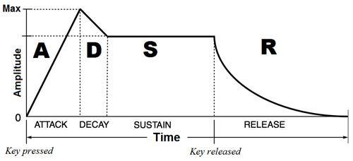

## What is 8 bit music
8 bit music is also called chip music.

At that time, only small memory can be installed in game console （e.g. FC). Producer cannot make high sampling-rate PCM music. But music is necessary when we play games. One solution is making music real time, which the played music can quickly clean the used memory and rebuild the next note. 

When making 8 bit music, we should storage the basic sound into the device priority. In the game music, we also needs to upload our music code (like the score) into the program. In this way we can make a game music, which become more popular in nowdays and gradually forming a new style on electricity music genre.

## How to make 8 bit mudic

We use FC (Family Computer) as an example to explain 8 bit music. In the music system of FC, instrument is not exist. It only provided different waves to producer. When composing, people needs to transform different waves into different audio effect.

5 tracks in FC:

1. square wave (2 track)

Square wave occupy two track, since it has variable proportions waves. Thus the wave generate different tone. Piano, guitar and other instrument can be simulated by this wave.  

2. triangular wave (1 track)

sometime we use this wave to simulate bass

3. noise (1 track)

Noise is the most common audio effect in games. We use noise to create the environment sound, like explode, footstep, crash and the rhythmic tapping.

4. Sampling (1 track)

Sampling track is more complex than other. We don't need to dig it all up. 

#### Note: How to modify a note

Usually, we use volumn, trill or envelope (ADSR) to polish the sound. 

## Web Audio

Here is a [website](https://codepen.io/anon/embed/LxJEaj?slug-hash=LxJEaj&default-tab=result&height=300&theme-id=0&embed-version=2&user=anon) to exhibit web audio: 

However, you may notice that FC didn't provide sin wave. Because sin/cos wave is published after the game console. It is more soft than normal FC sound. 

Tone.js is open source web audio SDK for developer make music using JS. We choose Tong.js because:

+ Tone.js accepted we edit pitch rather than ask us play 440Hz sound. For example, it packaged the scale into the library, we don't need to play a sound which exactly is 440Hz.
+ It packaged Attack and Release in ADSR (Attack, Decay, Sustain, Release). More convenience to develop 

## Steps

1. Essential functon in Tone.js for sounding.

    .triggerAttackRelease()

It including four parameter: note, duration, time and velocity.

Time is related to duration which represent the position of the note in a song; velocity is a detail change, sometime 8 bit music left this parameter unchanged.

The code below is a example to show how we use these four parameter to make music.

    var synth = new Tone.Synth().toMaster()
    synth.triggerAttackRelease('C4', '4n', '8n', 1)
    synth.triggerAttackRelease('E4', '8n', '4n + 8n', 1)

In this snippets, C4 and E4 represent the frequent of the sound. Time is accumulate and velocity is fixed. 

How about we use code to write one bar?

    var synth = new Tone.Synth().toMaster()
    Tone.Transport.bpm.value = 120

    synth.triggerAttackRelease('E4', '4n', '0', 1)
    synth.triggerAttackRelease('E4', '4n', '4n', 1)
    synth.triggerAttackRelease('F4', '4n', '2n', 1)
    synth.triggerAttackRelease('G4', '4n', '2n+4n', 1)

2. Using harmony

What is the harmony? It is two or more sound play together, following some rules. We can use different note at the same time to composite a new harmony. 

After finished the single track editing, we need to add more instruments.

    var triangleOptions = {
    oscillator: {
        type: 'triangle'
    }
    }

    var squareOptions = {
    oscillator: {
        type: 'square'
    }
    }

    var squareSynth = new Tone.Synth(squareOptions).toMaster()

    var triangleSynth = new Tone.Synth(triangleOptions).toMaster()

    var noiseSynth = new Tone.NoiseSynth().toMaster()

Each tone has different wave, which represent different instruments. `squareSynth` is used to play main melody instruments, such as piano, guitar. `trangleSynth` is used to simulate bass. `noiseSynth` is used to smulate percussion music。

3. Audio effect

Last step we should add audio effect to make music more rich. Like I mentioned before, ADSR can create some reverberation, echo and differnet pitch. These can be achieved by `Tone.Envelope()`.

Here is the code:

    envelope: {
    attack  : 0.01 ,
    decay  : 0.1 ,
    sustain  : 0.5 ,
    release  : 1 ,
    attackCurve  : linear ,
    releaseCurve  : exponential
    }

## Consolution
Pretty easy aha, I think the next generation of music must be computer music. 